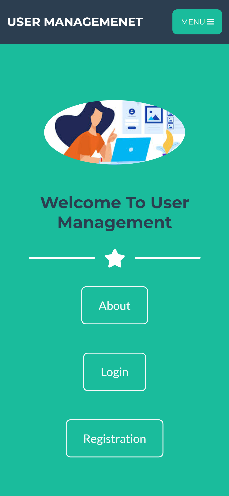

# 

# UserManagement -- web Application

> UserManagement is a simple user management app

## Table of contents

- 
- [UserManagement -- web Application](#usermanagement----web-application)
  - [Table of contents](#table-of-contents)
  - [App Description](#app-description)
  - [User Story](#user-story)
  - [Site Screenshots](#site-screenshots)
    - [Landing page that explains what the app does and how to get started.](#landing-page-that-explains-what-the-app-does-and-how-to-get-started)
    - [Users page where the users can see all the list of users and  edit, and delete users.](#users-page-where-the-users-can-see-all-the-list-of-users-and--edit-and-delete-users)
    - [Add user page where user can add user.](#add-user-page-where-user-can-add-user)
    - [Register page where the users can register.](#register-page-where-the-users-can-register)
    - [Login page where the users can login to use this application.](#login-page-where-the-users-can-login-to-use-this-application)
  - [Built with](#built-with)
  - [Development](#development)

## App Description

<table>
<tr>
<td>
 User management is a user managing application. It's a JAVA dynamic webapp. This application build using JSP + Servlet + JDBC + MySQL. To use this application user need to registration then login to the application. With this application admin can save user information, edit the information and Delete the information. This website is supported on Chrome, Firefox, and Safari. This app is a fully responsive website. This app is responsive.

</td>
</tr>
</table>

## User Story

* I can register.

* I can login.

* I can see all the list of my user.

* I can save user.

* I can view all users.

* I can edit users.

* I can delete users.

## Site Screenshots

### Landing page that explains what the app does and how to get started.

Desktop view | Mobile view
------------- | -------------
 | 

### Users page where the users can see all the list of users and  edit, and delete users.
Desktop view | Mobile view
------------- | -------------
 | 

### Add user page where user can add user.
Desktop view | Mobile view
------------- | -------------
 | 

### Register page where the users can register.
Desktop view | Mobile view
------------- | -------------
 | 

### Login page where the users can login to use this application.
Desktop view | Mobile view
------------- | -------------
 | 

## Built with

- Java
- JSP 
- css

## Development

Want to contribute? Great Please reachout to me.

Thanks in advance!

Thanks again for your time.

